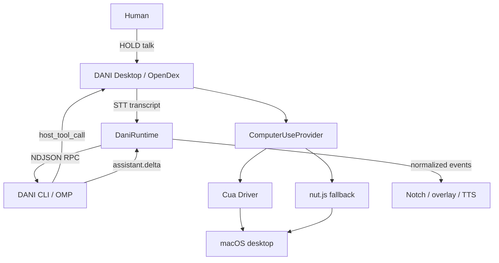
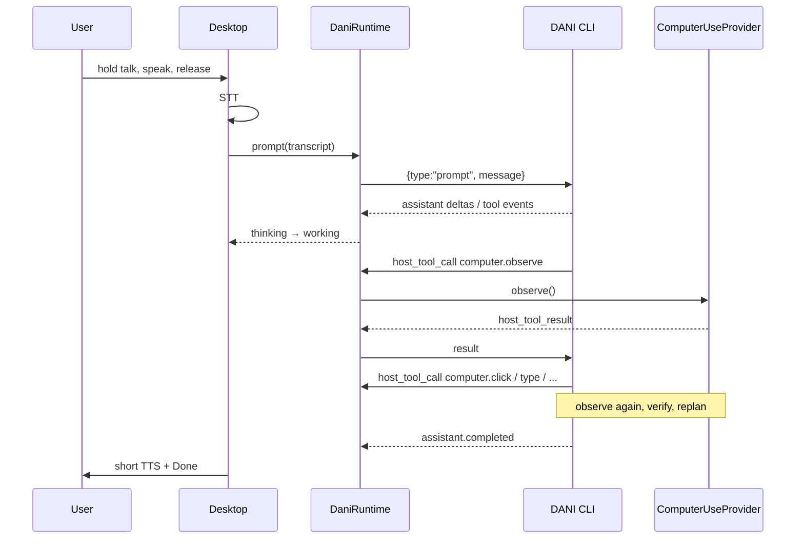

# Target state — DANI Desktop

One brain: **DANI CLI** (`dani --mode rpc`). OpenDex is the face + device host.



No OpenMausBot. No Clicky. No second agent loop. No OpenCode-as-LLM inside OpenDex.

## Ownership

| Layer | Owns | Does not own |
|---|---|---|
| Desktop | Electron, notch, PTT, mic, STT, TTS, TCC, approvals UI, spawning DANI, host tools | Prompts, model auth, planning, tool choice |
| DANI CLI | Models, login, reasoning, sessions, memory, retries, compaction | Mic, windows, macOS permissions UI |
| ComputerUseProvider | Observe/act on this Mac | Why to act |

## Process model

```
OpenDex.app (main)
  ├─ renderer (voice UI only)
  ├─ child: `dani --mode rpc`   (brain, long-lived)
  └─ optional: Cua runtime      (same app identity for TCC)
```

Health: `starting | ready | degraded | disconnected | restarting | failed`. Bounded backoff. Never silent infinite restart.

## DaniRuntime (desktop adapter)

Thin. Does not reimplement OMP. Speaks the existing NDJSON contract.

```ts
interface DaniRuntime {
  start(): Promise<void>
  stop(): Promise<void>
  prompt(input: { text: string; missionId?: string }): Promise<void>
  steer(input: { text: string }): Promise<void>
  abort(): Promise<void>
  getState(): Promise<unknown>
  getAvailableModels(): Promise<unknown>
  setModel(provider: string, modelId: string): Promise<void>
  getLoginProviders(): Promise<unknown>
  login(providerId: string): Promise<void>
  setHostTools(tools: HostTool[]): Promise<void>
  subscribe(listener: (e: DaniEvent) => void): () => void
}
```

Implementation: `OmpRpcRuntime` wrapping spawn of `/usr/local/bin/dani` (configurable path). Do **not** import dani-fork into the Electron bundle.

Renderer never sees RPC frames. Main normalizes → IPC → UI.

## Canonical UI state

Map many RPC events onto few product states:

`idle | listening | thinking | working | waiting | needs_user | blocked | done | error`

Default UI: notch. No chain-of-thought. Developer mode can dump RPC.

## Event flow (voice mission)



## ComputerUseProvider

```ts
interface ComputerUseProvider {
  observe(): Promise<ObserveResult>
  screenshot(opts?: { region?: Region; displayId?: string }): Promise<Screenshot>
  listWindows(): Promise<WindowInfo[]>
  inspectAccessibilityTree(target?: WindowId): Promise<AxNode>
  click(p: Point, opts?: ClickOpts): Promise<void>
  doubleClick(p: Point): Promise<void>
  rightClick(p: Point): Promise<void>
  drag(from: Point, to: Point): Promise<void>
  typeText(text: string): Promise<void>
  pressKey(keys: string[]): Promise<void>
  hotkey(keys: string[]): Promise<void>
  scroll(opts: ScrollOpts): Promise<void>
  openApp(name: string): Promise<void>
  focusWindow(id: WindowId): Promise<void>
  getActiveApplication(): Promise<AppInfo>
}
```

Grounding order: AX / app semantics → screenshot → raw x/y last.

MVP impl: wrap existing nut.js + `screen-capture.ts` (`NutComputerUseProvider`). Production impl: `CuaComputerUseProvider` once embedding + TCC ownership is verified against current Cua docs. Swap behind the interface. Do not leak Cua types into UI.

Host tool names registered on DANI (exact names follow OMP `set_host_tools` schema at impl time):

`computer.observe`, `computer.screenshot`, `computer.list_windows`, `computer.accessibility_tree`, `computer.click`, `computer.double_click`, `computer.right_click`, `computer.drag`, `computer.type`, `computer.scroll`, `computer.keypress`, `computer.hotkey`, `computer.open_app`, `computer.focus_window`, `computer.active_app`

## Auth

Settings “How Dani thinks” is a **UI** over `get_login_providers` / `login` / `get_available_models` / `set_model`. Credentials stay in DANI’s store. OpenDex keeps only STT/TTS secrets.

## Approvals

Intent-level. DANI (or desktop policy) requests approval for side effects (send, delete, pay, publish). Not per click. Reuse the permission popup window.

## Mission / AgentSession (boundaries only)

```ts
Mission { id, goal, status, createdAt, updatedAt, currentSessionId, completionSummary }
AgentSession { id, runtimeSessionId, model, status, missionId, createdAt, updatedAt }
```

Persist as JSON in userData. No orchestrator. A2A later.

## Talk gesture

Product: HOLD Fn. Constraint: Electron cannot register Fn.

- MVP: hold-to-talk on a configurable global accelerator (press = listen start, release = STT+prompt). Change from today’s toggle.
- Next: IOHID/CGEvent tap in **main**, attributed to OpenDex.app, for Fn hold.

## Security (non-negotiable)

- Renderer: no secrets, no native CU, no arbitrary eval.
- Validate IPC payloads.
- Screen content is untrusted (prompt injection).
- Computer actions audited in main (tool name, time, not raw screenshots in logs).
- TCC identity = OpenDex.app.

## What stays in the UI

Notch, overlay Stop, tray, summon, local STT, system TTS, onboarding shell (rewired to DANI login), settings chrome, themes as visual skins.

## What leaves the critical path

`streamChat` as brain, `resolveModel` as product auth, OpenCode Zen provider, realtime as default, chatbot-shaped transcript as the home screen.
